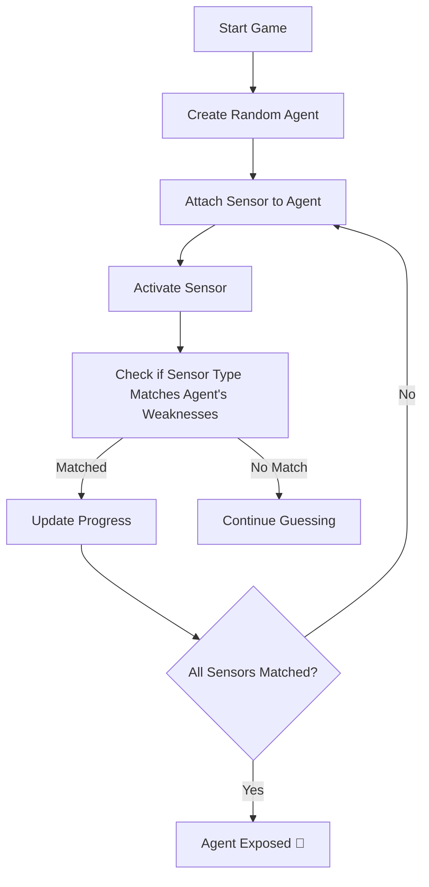

# SensorsProject - Iranian Agent Investigation Game

## Overview

"SensorsProject" is an engaging object-oriented C# game designed to simulate intelligence-based investigation of Iranian agents using sensor technologies. Built with clean design principles (OOP, SOLID), the project allows a player to attach sensors to enemy agents in a turn-based gameplay format, attempting to expose them by matching hidden sensor vulnerabilities. The system is expandable with new sensors, agents, and game mechanics.

---

## 📁 Project Structure

```
SensorsProject/
├── Agents/                     # Iranian agent types and logic
├── Sensors/                    # Sensor types and sensor base
├── Managers/                   # Game management logic
├── Enums/                      # Enum definitions for types
├── Program.cs                  # Game entry point (console interface)
```

---

## 🎯 Game Concept

1. **Goal:** Discover the secret vulnerabilities (sensor types) of each Iranian agent.
2. **How?** Attach sensors each turn, activate them, and receive partial feedback (e.g., 1/2 correct).
3. **Victory:** When all required sensors are correctly attached → agent is exposed.
4. **Challenge:** Some agents counterattack. Some sensors break after use. Trial and error is key.

---

## 🧠 Core Mechanics

### Agents

Each agent has:

* A **rank** (e.g., FootSoldier, SquadLeader, etc.)
* A **secret vulnerability list** of required sensor types
* A **sensor slots count** (how many sensors must be attached)
* Optional **counterattack logic** (for senior agents)

### Sensors

Each sensor has:

* A **name**
* A **sensor type** (from `SensorsTypes` enum)
* An **Activate()** method
* Some have **limitations** (e.g., break after 3 uses)

### Gameplay Flow



---

## 🔧 Enums

### `SensorsTypes`

```csharp
enum SensorsTypes
{
    AudioSensor,
    ThermalSensor,
    PulseSensor,
    MotionSensor,
    MagneticSensor,
    SignalSensor,
    LightSensor
}
```

Purpose: Allow type-checking and logic routing for different sensor behaviors.

### `IranianAgentsTypes`

Defines various agent ranks with different behavior patterns.

---

## 📚 Detailed File & Method Descriptions

### 🗂️ SensorsProject/Agents

#### `Agent.cs`

Base class for all Iranian agents.

* `Name`, `Id`, `CounterattackFrequency`, `SensorsAttached`, `WeaknessList`
* `AttachSensor(Sensor sensor)` → Adds a sensor to the agent.
* `CheckCorrectSensors()` → Compares current sensors to weaknesses.
* `CanBeExposed()` → Returns true if agent is fully revealed.
* `Counterattack()` → Virtual, overridden by senior agents.

#### Inherited Classes

* `FootSoldier.cs` → No counterattack.
* `SquadLeader.cs`, `SeniorCommander.cs`, `OrganizationLeader.cs`

  * Each adds logic for periodic sensor removal or weakness list reset.

### 🗂️ SensorsProject/Sensors

#### `Sensor.cs`

Base sensor class.

* `Name`, `SensorType`, `IsActivated`
* `Activate()` → Sets `IsActivated = true`

#### Sensor Types (Inherit `Sensor`):

* `AudioSensor.cs`
* `PulseSensor.cs` → Overrides `Activate()` to count uses and self-destruct after 3
* `ThermalSensor.cs`, `LightSensor.cs`, etc. → Each can have future abilities (e.g., reveal info)

### 🗂️ SensorsProject/Managers

#### `InvestigationManager.cs`

Game logic controller.

* Initializes agents
* Manages sensor attaching
* Checks sensor correctness
* Tracks agent exposure and win conditions

### 🗂️ Enums/

Contains `SensorsTypes.cs`, `IranianAgentsTypes.cs` for game logic clarity.

---

## 🕹️ Game Example

```
Welcome to SensorsProject!
Agent Created: FootSoldier
Sensor slots: 2

Turn 1: Attach sensor → AudioSensor → Activated → Match: 1/2
Turn 2: Attach sensor → AudioSensor → Activated → Match: 2/2 → Agent Exposed 🎯
```

---

## 💥 Advanced Features (Stage 2)

| Feature           | Description                                        |
| ----------------- | -------------------------------------------------- |
| Counterattack     | High-ranking agents remove sensors every few turns |
| Sensor Durability | Some sensors break (Pulse, Motion) after N uses    |
| Sensor Abilities  | Reveal hidden info (e.g., Magnetic blocks attacks) |
| SQL Save/Load     | Future support for storing investigation history   |

---

## 🚀 Getting Started

### Requirements

* .NET 6.0+
* Visual Studio / JetBrains Rider / VSCode with C# plugin

### Run the Game

```bash
1. git clone https://github.com/BaruchShor/SensorsProject
2. Open project in IDE
3. Set `Program.cs` as startup file
4. Run
```

---

## 🧩 Expansion Ideas

* Multiplayer investigation
* JSON-based sensor/agent configuration
* Web frontend
* Level-based progression

---

## 🤝 Credits

Developed by Baruch Shor. Special thanks to the 8200 simulation team.

---

## 📬 Feedback

If you have ideas for new sensors or agent abilities – open an issue or contribute via PR!

---

## 🔒 License

MIT License – free for academic and educational use.
